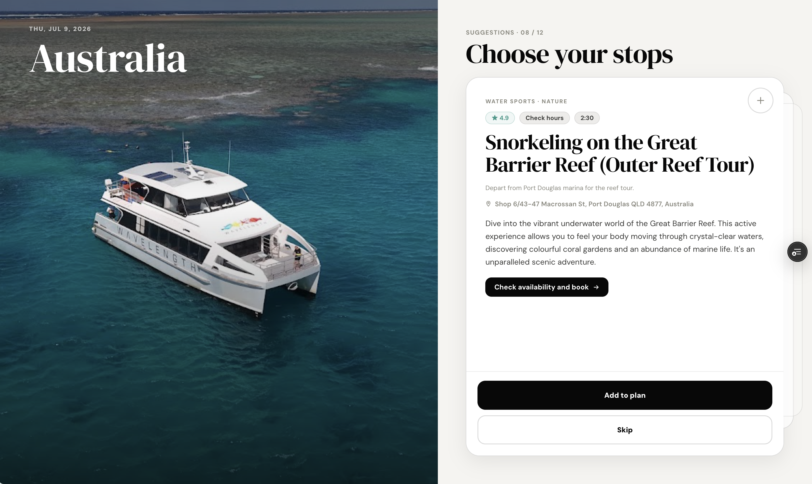

# outdone

outdone is an AI-assisted travel planning prototype that turns a destination, date, and a few vibe signals into a curated set of places the user can choose from. Instead of generating one fixed itinerary immediately, outdone lets people browse suggestions, add the stops they like, reorder them, and then create a final timeline-style plan.



## What It Does

- Generates 12 real place suggestions for a trip, including restaurants, activities, sights, and bookable experiences.
- Uses a card-stack flow so users can add stops to their plan or skip them.
- Builds a final itinerary timeline from selected stops.
- Enriches stops with Google Places data such as ratings, addresses, photos, maps links, and opening status.
- Includes Google Maps route links, calendar export, sharing, regeneration, and vibe editing.
- Supports Google sign-in with public Privacy Policy and Terms of Use pages.

## Tech Stack

- React
- Vite
- Vercel serverless functions
- Google Places API / Places API New
- Google Maps links
- Gemini API

## Project Structure

```text
api/
  generate.js
  place-autocomplete.js
  place-photo.js
  save-itinerary.js

public/
  privacy.html
  terms.html

src/
  main.jsx
  styles.css

docs/
  readme-hero.png
```

## Environment Variables

Create these in Vercel before deploying:

```text
GEMINI_API_KEY=...
GOOGLE_MAPS_API_KEY=...
VITE_GOOGLE_CLIENT_ID=...
```

For `GOOGLE_MAPS_API_KEY`, use a server-safe key for the Vercel API routes. Do not use website referrer restrictions on this server key, because the requests come from Vercel, not directly from the browser.

Recommended Google APIs:

- Places API
- Places API (New)
- Geocoding API
- Maps JavaScript API, only if using a separate browser key

## Local Development

```bash
npm install
npm run dev
```

Build:

```bash
npm run build
```

Lint:

```bash
npm run lint
```

## Legal Pages

The Google OAuth consent screen can use these public URLs after deployment:

```text
https://your-domain.vercel.app/privacy.html
https://your-domain.vercel.app/terms.html
```

The source files live in:

```text
public/privacy.html
public/terms.html
```

## Notes

outdone is a prototype. Generated recommendations should be checked before travel, especially opening hours, prices, booking requirements, safety conditions, and transportation details.

© 2026 Sanjana Venkat. All rights reserved.
